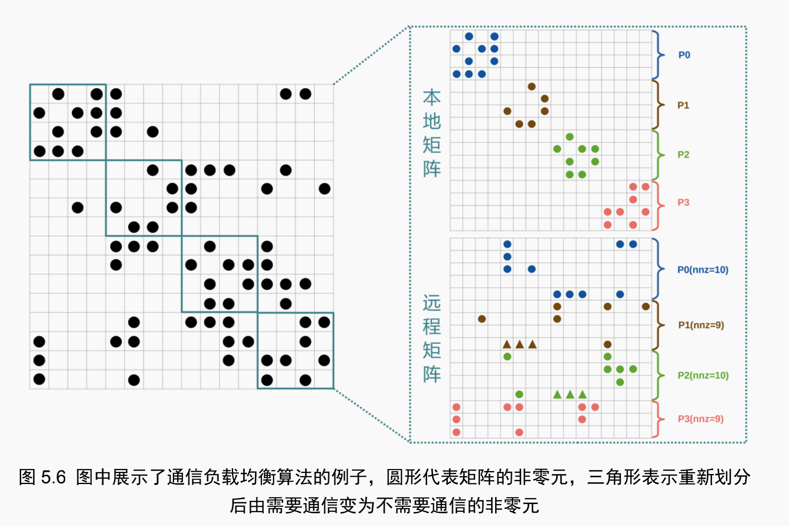

##### 1. Input part
   + 一个$n*n$方阵
   + 一个向量(随机生成$[1,10]$的数)
   + 进程数p
   + 服务器分配方案
   + 线程数
   `mpirun -n 4 -f f1 ./combal.3 /home/fx/Desktop/test_matrix/fx/FullChip.mtx  5
`
##### 2. Reorder part
   `METIS_PartGraphKway`
   + 首先获取重排顺序
   + 分别对矩阵和向量重排

##### 3. 划分子矩阵(本地矩阵、远程矩阵)和子向量
   + 分成本地矩阵和远程矩阵
   
   + 子向量和本地矩阵划分，方法：前p-1个的行数都是floor(n/p),第p个是剩下的行数
    eg1. `n=9 p=4` 子矩阵行数是`2 2 2 3`
    eg2. `n=8 p=4` 子矩阵行数是`2 2 2 2`
   + 远程矩阵的划分，方法：前i个进程的非零元个数和不低于ceil(nnz/p*i)
    eg. 上图的远程矩阵
    
##### 4. 计算子向量给子矩阵发送的消息
   + 遍历子矩阵的非零元
   + 如果此非零元满足以下条件，则需要发送消息
      + 该列之前没有发送消息，x只会对同一个子矩阵发送一遍
   + 经过以上两个步骤之后，我们可以得到以下信息：
      + 发送消息的进程号
      + 接收消息的进程号
      + 发送消息的行号（接收消息的列号）
      + 值val
   
##### 5. 主进程（0号进程）向子进程发送消息
   + 子矩阵（本地矩阵、远程矩阵）
   + 子向量
   + part4 发送的消息（4.3.1发送消息的进程号=子进程号）
        （只是做好准备，没有真正发）

##### 6. 各子进程接收来自主进程的消息

##### 7. 各子进程分别向需要该子向量信息的进程主动发送信息（相互通信）
    等待接收信息的同时，计算本地spmv

##### 8. 各子进程接收来自其他子进程的消息
    到此为止，就能进行远程矩阵spmv运算了
    
##### 9. 计算远程spmv

##### 10. 汇总并校验答案